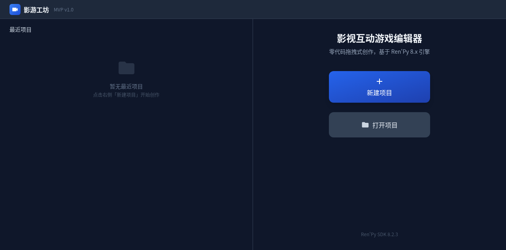
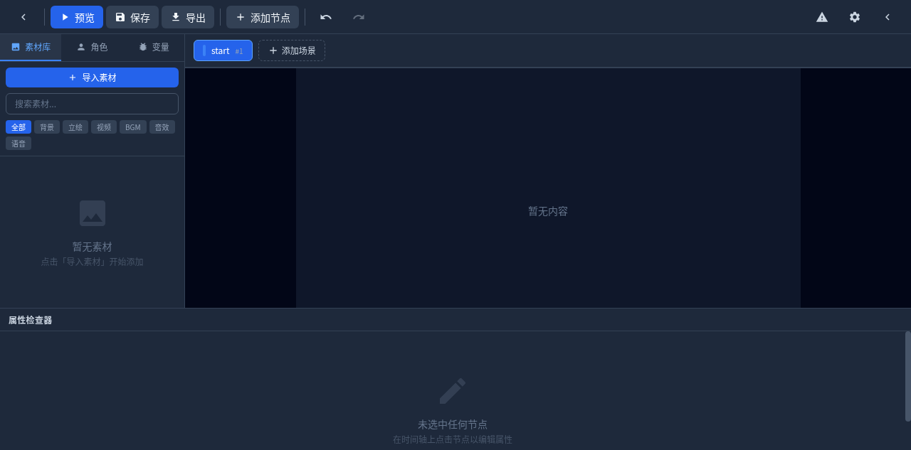
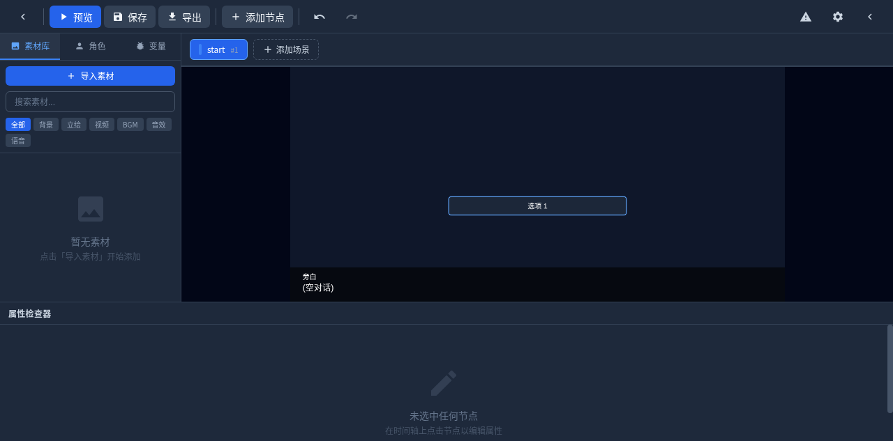

# 影游工坊

<p align="center">
  
  
  
  
  
  
</p>

<p align="center">
  零代码拖拽式影视互动游戏编辑器，基于 Ren'Py 8.x 引擎
</p>

---

## 是什么

影游工坊是一款面向创作者的可视化叙事工具。它将 Ren'Py 的底层能力封装进一个直觉化的拖拽界面，让没有编程背景的人也能在数分钟内搭建起一部完整的互动视觉小说或影视互动游戏。

编辑器遵循"所见即所得"的哲学：你在时间轴上排列的分镜节点，会实时渲染在画布中央；你点击节点调整的属性，会即时反映在预览画面中。一切改动最终会被编译成标准 Ren'Py 脚本，可直接运行或二次开发。

## 实际效果

### 启动器

启动器以深色界面呈现，左侧展示最近项目列表，右侧提供新建与打开入口。整体风格克制、专注，不让多余元素分散创作注意力。



### 编辑器主界面

进入项目后，工作区被划分为三个主要区域：左侧素材/角色/变量面板、中央画布实时预览、底部时间轴与属性检查器。所有操作都围绕"拖拽"和"点击"展开，无需记忆任何快捷键即可上手。



### 分镜节点与实时预览

在时间轴上添加对话节点后，画布会实时渲染出对话框与文本内容；添加选项节点后，中央会出现可交互的选项按钮占位。这种即时反馈机制让创作者能直观感知最终作品的视觉节奏。



## 核心能力

- **六轨道时间轴**：背景、立绘、对话、音频、选项、跳转/标签六个独立轨道，各轨道节点按时间顺序排列，支持跨轨道拖拽重排
- **实时画布预览**：基于 PixiJS 的渲染引擎，节点的每一次增删改都会即时反映在中央画布上
- **一键编译导出**：项目数据通过拓扑排序与节点映射，自动编译为标准 Ren'Py `.rpy` 脚本，包含 `script.rpy`、`options.rpy`、`variables.rpy`、`screens.rpy`
- **撤销/重做系统**：基于 zundo 的状态回溯，最多保留 50 步历史
- **浏览器与桌面双模式**：浏览器环境通过 localStorage 降级存储；Electron 环境下直接操作文件系统，支持 Ren'Py 实时预览

## 技术栈

| 层级 | 技术 |
|------|------|
| UI 框架 | React 18.2 + TypeScript 5.3 |
| 样式系统 | Tailwind CSS 3.4 |
| 状态管理 | Zustand 4.5 + zundo（撤销/重做） |
| 画布渲染 | PixiJS 8.2 |
| 拖拽交互 | @dnd-kit 6.0 |
| 桌面封装 | Electron 28 |
| 构建工具 | Vite 5 |
| 目标引擎 | Ren'Py 8.2.3 |

## 分镜节点类型

| 节点 | 说明 |
|------|------|
| 背景 | 场景切换，支持 dissolve / fade / pushright / wipeleft 四种过渡 |
| 立绘 | 角色立绘显示/隐藏，支持屏幕位置、表情、入场动效、z-order |
| 对话 | 旁白或角色台词，支持字体样式、语音绑定、自动推进 |
| 视频 | 插入视频片段，支持播放后暂停或继续 |
| 音频 | BGM / 音效 / 语音的播放、停止、暂停、恢复，支持淡入淡出 |
| 选项 | 分支选择菜单，支持条件选项、变量副作用、场景跳转 |
| 跳转/标签 | 内部 label 定义、场景跳转、return 返回 |
| 变量操作 | 对项目变量进行 set / add / subtract / multiply / divide |

## 编译器映射

编辑器内置的编译器将可视化节点映射为 Ren'Py 语法：

- 每个场景对应一个 `label`，场景名经 sanitize 后作为 label 名
- 背景节点映射为 `scene bg_xxx` + `with Dissolve(0.5)`
- 立绘节点映射为 `show character emotion at left`
- 对话节点映射为 `speaker "台词"` 或 `"旁白"`
- 选项节点映射为 `menu:` 块，条件选项使用 `"选项文本" if condition:` 行内语法
- 音频节点映射为 `play music / play sound / stop music`
- 变量操作映射为 `$ var += value`

## 本地运行

```bash
# 安装依赖
npm install

# 浏览器模式开发
npm run dev

# 构建
npm run build

# 运行测试
npm run test

# Electron 桌面模式
npm run electron:dev
```

## 项目结构

```
yingyou-workshop/
├── src/
│   ├── types/          # 核心数据模型与类型定义
│   ├── stores/         # Zustand 状态管理（项目、UI、Toast）
│   ├── services/       # 编译器、文件服务、拓扑排序
│   ├── components/     # React 组件
│   │   ├── Launcher/   # 启动器
│   │   ├── Editor/     # 编辑器布局
│   │   ├── Timeline/   # 时间轴
│   │   ├── Canvas/     # 画布预览
│   │   ├── Inspector/  # 属性检查器
│   │   └── ui/         # 通用 UI 组件
│   └── App.tsx
├── electron/           # Electron 主进程与 IPC
├── tests/              # Vitest 单元测试
└── docs/               # 截图与文档
```

## 许可证

MIT
